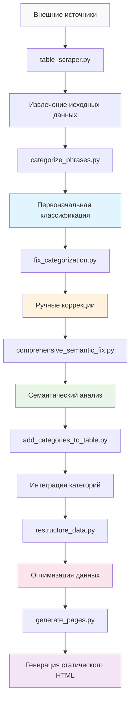

# Архитектура данных

## Обзор

Проект фразеологизмов использует сложную архитектуру данных, разработанную для эффективного хранения, обработки и предоставления русских фразеологических единиц. Система использует хранение на основе JSON с семантической категоризацией и автоматизированными механизмами обеспечения качества.

## Модель данных

### Основная структура данных

#### `table_phrases.json` (377.9KB)
**Основной файл данных, используемый веб-сайтом**

```json
{
  "categories": {
    "category_id": {
      "name": "Отображаемое имя категории",
      "description": "Описание категории",
      "keywords": ["ключевое слово1", "ключевое слово2", ...]
    }
  },
  "phrases": [
    {
      "phrase": "Текст фразеологической единицы",
      "meanings": ["Основное значение", "Альтернативное значение"],
      "etymology": "Историческое происхождение и контекст",
      "category": "semantic_category_id"
    }
  ]
}
```

### Схема категорий

#### Семантические категории (20+ категорий)
Каждая категория содержит:
- **`name`**: Человекочитаемое имя категории на русском языке
- **`description`**: Пояснительный текст об области действия категории
- **`keywords`**: Массив ключевых слов для автоматической категоризации

#### Примеры категорий:
```json
{
  "emotions_feelings": {
    "name": "Эмоции и чувства",
    "description": "Фразеологизмы о эмоциональных состояниях и переживаниях",
    "keywords": ["любовь", "ненавист", "радост", "грусть", ...]
  },
  "work_labor": {
    "name": "Труд и работа", 
    "description": "Фразеологизмы о работе, труде и профессиональной деятельности",
    "keywords": ["работ", "труд", "дело", "служб", ...]
  }
}
```

### Схема фраз

#### Основные данные фразы
Каждая запись фразы включает:
- **`phrase`**: Идиоматическое выражение (строка)
- **`meanings`**: Массив определений и объяснений
- **`etymology`**: Исторический фон и происхождение
- **`category`**: Идентификатор семантической категории

#### Пример записи фразы:
```json
{
  "phrase": "золотая молодёжь",
  "meanings": ["Дети богатых родителей"],
  "etymology": "",
  "category": "money_wealth"
}
```

## Поток данных и конвейер обработки

### Этапы обработки



### 1. Извлечение данных
**`table_scraper.py`** - Сбор внешних данных
- **Источники**: Веб-скрейпинг из образовательных ресурсов
- **Валидация**: Проверки качества данных во время извлечения
- **Формат**: Структурированное извлечение в формат JSON
- **Удаление дубликатов**: Удаление повторяющихся записей

### 2. Первоначальная категоризация  
**`categorize_phrases.py`** - Классификация на основе ключевых слов
- **Метод**: Сопоставление ключевых слов с определениями категорий
- **Правила**: Логика категоризации на основе паттернов
- **Результат**: Начальные назначения категорий
- **Покрытие**: Автоматическая классификация для массовой обработки

### 3. Ручные коррекции
**`fix_categorization.py`** - Коррекции на основе правил
- **Назначение**: Исправление известных ошибок категоризации
- **Метод**: Явные сопоставления фраза-категория
- **Обслуживание**: Ручное создание правил коррекции
- **Качество**: Высокоточные целевые исправления

### 4. Семантический анализ
**`comprehensive_semantic_fix.py`** - Валидация на основе ИИ
- **Подход**: Семантический анализ значений полных выражений
- **Правила**: 401 исправление применено на основе семантики фраз
- **Валидация**: Оценка коррекций по уровню уверенности
- **Отчетность**: Генерация подробного отчета о коррекциях

### 5. Интеграция данных
**`add_categories_to_table.py`** - Интеграция метаданных категорий
- **Функция**: Объединение определений категорий с данными фраз
- **Согласованность**: Обеспечение целостности ссылок
- **Валидация**: Проверка всех фраз на наличие допустимых категорий

### 6. Оптимизация данных
**`restructure_data.py`** - Оптимизация для фронтенда
- **Назначение**: Оптимизация структуры данных для потребления клиентской стороной
- **Производительность**: Минимизация размера JSON и времени парсинга
- **Структура**: Организация данных для эффективной фильтрации и отображения

## Версии и варианты данных

### Множественные файлы данных
**Стратегия контроля версий и резервного копирования**

#### `table_phrases.json` (377.9KB)
- **Основной**: Главный файл, используемый веб-сайтом
- **Статус**: Текущие производственные данные
- **Качество**: Семантически исправленные и проверенные

#### `table_phrases_fixed.json` (376.2KB)  
- **Назначение**: Применены правила ручной коррекции
- **Этап**: Промежуточная версия обработки
- **Использование**: Разработка и тестирование

#### `table_phrases_semantic_fixed.json` (376.5KB)
- **Назначение**: Продвинутые семантические коррекции
- **Особенности**: Улучшения категоризации на основе ИИ
- **Статус**: Версия с улучшенным качеством

#### `semantic_corrections_report.json` (281.7KB)
- **Содержание**: Подробный анализ коррекции и статистика
- **Данные**: 401 коррекция с оценками уверенности
- **Назначение**: Обеспечение качества и аудиторский след

## Обеспечение качества данных

### Механизмы валидации

#### Семантическая валидация
- **Принцип**: Категоризация на основе полного значения фразы
- **Метод**: Расширенное сопоставление паттернов и семантический анализ
- **Правила**: Избегать категоризацию только по ключевым словам
- **Примеры**: 
  - "золотая молодёжь" → `money_wealth` (не `religion_mythology`)
  - "овчинка выделки не стоит" → `work_labor` (не `animals`)

#### Проверки согласованности
- **Целостность ссылок**: Все фразы имеют допустимые ссылки на категории
- **Полнота данных**: Наличие обязательных полей для всех записей
- **Валидация формата**: Валидация структуры и синтаксиса JSON
- **Кодировка**: Согласованность UTF-8 во всех файлах

#### Метрики качества
- **Покрытие**: 10 000+ фразеологических единиц
- **Категории**: 20+ семантических категорий
- **Коррекции**: 401 семантическое улучшение применено
- **Точность**: Категоризация с высокой степенью уверенности (оценка ≥ 5)

## Оптимизация производительности

### Оптимизация структуры данных

#### Эффективность JSON
- **Минификация**: Компактное форматирование JSON для производства
- **Индексация**: Оптимизировано для фильтрации по категориям
- **Кэширование**: Структура, дружественная к кэшированию браузера
- **Сжатие**: Готово к gzip для веб-доставки

#### Производительность клиентской стороны
- **Ленивая загрузка**: Загрузка данных на основе категорий
- **Фильтрация**: Эффективная фильтрация данных на клиентской стороне
- **Поиск**: Быстрый текстовый поиск фраз
- **Память**: Оптимизировано для ограничений мобильных устройств

### Стратегия хранения

#### Организация файлов
```
data/
├── table_phrases.json           # Производственные данные
├── table_phrases_fixed.json     # Версия для разработки
├── table_phrases_semantic_fixed.json  # Улучшенная версия
└── semantic_corrections_report.json   # Отчет о качестве
```

#### Стратегия резервного копирования
- **Контроль версий**: Отслеживание изменений на основе Git
- **Множественные версии**: Параллельные файлы данных для отката
- **Регулярный экспорт**: Автоматическая генерация резервных копий
- **Отчеты о качестве**: Подробная документация изменений

## Паттерны доступа к данным

### Загрузка данных фронтенда
**Потребление JSON на клиентской стороне**

#### Фильтрация по категориям
```javascript
// Загрузка данных определенной категории
const categoryPhrases = allPhrases.filter(
  phrase => phrase.category === targetCategory
);
```

#### Функциональность поиска
```javascript
// Текстовый поиск фраз
const searchResults = allPhrases.filter(phrase =>
  phrase.phrase.toLowerCase().includes(searchTerm.toLowerCase()) ||
  phrase.meanings.some(meaning => 
    meaning.toLowerCase().includes(searchTerm.toLowerCase())
  )
);
```

### Доступ к данным викторины
**Выбор фраз без повторений**

#### Случайный выбор
```javascript
// Избегать ранее использованных фраз
const availablePhrases = allPhrases.filter(
  phrase => !usedPhrases.has(phrase.phrase)
);
const randomPhrase = availablePhrases[
  Math.floor(Math.random() * availablePhrases.length)
];
```

## Точки интеграции

### Интеграция компонентов
**Поток данных к компонентам фронтенда**

#### Динамическая загрузка
- **Загрузчик компонентов**: `component-loader.js` управляет контекстом данных
- **Страницы категорий**: Автоматическая фильтрация данных по категориям
- **Система викторин**: Доступ к данным в реальном времени для интерактивных функций
- **Навигация**: Генерация меню на основе категорий

#### Совместимость API
- **Структура RESTful**: Структура JSON, подходящая для преобразования в REST API
- **Будущее расширение**: Готово для интеграции с бэкенд API
- **Кэширование**: Стратегии кэширования CDN и браузера
- **Версионирование**: Отслеживание версий данных для совместимости API

## Управление данными

### Стандарты качества
- **Семантическая точность**: Категоризация на основе значений
- **Культурная аутентичность**: Правильное использование русского языка
- **Образовательная ценность**: Подходит для изучения языка
- **Полнота**: Комплексные данные о значении и этимологии

### Рабочий процесс обслуживания
1. **Обновления данных**: Добавление новых фраз или изменение существующих записей
2. **Качественная обработка**: Запуск скриптов категоризации и коррекции
3. **Валидация**: Проверка целостности данных и семантической точности
4. **Тестирование**: Локальное тестирование с сервером разработки
5. **Развёртывание**: Обновление производственных файлов данных

### Будущие улучшения
- **Миграция базы данных**: Интеграция с PostgreSQL для продвинутых запросов
- **Разработка API**: RESTful API для внешних интеграций  
- **Обновления в реальном времени**: Динамическое управление контентом
- **Продвинутая аналитика**: Отслеживание использования и аналитика обучения

---

*Эта архитектура данных поддерживает текущий подход статического сайта, одновременно обеспечивая гибкость для будущей интеграции базы данных и разработки API.*