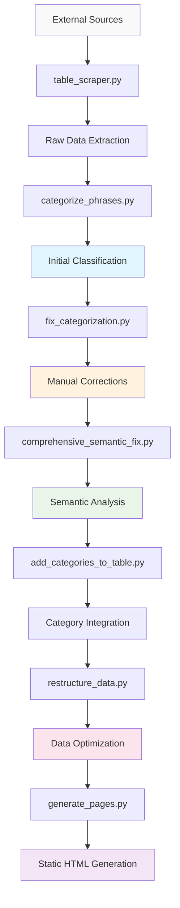

# Data Architecture

## Overview

The frazeologizms project employs a sophisticated data architecture designed to efficiently store, process, and serve Russian phraseological units. The system uses JSON-based storage with semantic categorization and automated quality assurance mechanisms.

## Data Model

### Primary Data Structure

#### `table_phrases.json` (377.9KB)
**Main data file used by the website**

```json
{
  "categories": {
    "category_id": {
      "name": "Category Display Name",
      "description": "Category description",
      "keywords": ["keyword1", "keyword2", ...]
    }
  },
  "phrases": [
    {
      "phrase": "Phraseological unit text",
      "meanings": ["Primary meaning", "Alternative meaning"],
      "etymology": "Historical origin and context",
      "category": "semantic_category_id"
    }
  ]
}
```

### Category Schema

#### Semantic Categories (20+ categories)
Each category contains:
- **`name`**: Human-readable category name in Russian
- **`description`**: Explanatory text about the category scope
- **`keywords`**: Array of keywords for automatic categorization

#### Example Categories:
```json
{
  "emotions_feelings": {
    "name": "Эмоции и чувства",
    "description": "Фразеологизмы о эмоциональных состояниях и переживаниях",
    "keywords": ["любовь", "ненавист", "радост", "грусть", ...]
  },
  "work_labor": {
    "name": "Труд и работа", 
    "description": "Фразеологизмы о работе, труде и профессиональной деятельности",
    "keywords": ["работ", "труд", "дело", "служб", ...]
  }
}
```

### Phrase Schema

#### Core Phrase Data
Each phrase entry includes:
- **`phrase`**: The idiomatic expression (string)
- **`meanings`**: Array of definitions and explanations
- **`etymology`**: Historical background and origin story
- **`category`**: Semantic category identifier

#### Example Phrase Entry:
```json
{
  "phrase": "золотая молодёжь",
  "meanings": ["Дети богатых родителей"],
  "etymology": "",
  "category": "money_wealth"
}
```

## Data Flow & Processing Pipeline

### Processing Stages



### 1. Data Extraction
**`table_scraper.py`** - External data collection
- **Sources**: Web scraping from educational resources
- **Validation**: Data quality checks during extraction
- **Format**: Structured extraction into JSON format
- **Deduplication**: Removal of duplicate entries

### 2. Initial Categorization  
**`categorize_phrases.py`** - Keyword-based classification
- **Method**: Keyword matching against category definitions
- **Rules**: Pattern-based categorization logic
- **Output**: Initial category assignments
- **Coverage**: Automated classification for bulk processing

### 3. Manual Corrections
**`fix_categorization.py`** - Rule-based fixes
- **Purpose**: Address known categorization errors
- **Method**: Explicit phrase-to-category mappings
- **Maintenance**: Hand-curated correction rules
- **Quality**: High-precision targeted fixes

### 4. Semantic Analysis
**`comprehensive_semantic_fix.py`** - AI-powered validation
- **Approach**: Semantic meaning analysis of complete expressions
- **Rules**: 401 corrections applied based on phrase semantics
- **Validation**: Scores corrections by confidence level
- **Reporting**: Detailed correction report generation

### 5. Data Integration
**`add_categories_to_table.py`** - Category metadata integration
- **Function**: Merge category definitions with phrase data
- **Consistency**: Ensure referential integrity
- **Validation**: Verify all phrases have valid categories

### 6. Data Optimization
**`restructure_data.py`** - Frontend optimization
- **Purpose**: Optimize data structure for client-side consumption
- **Performance**: Minimize JSON size and parsing time
- **Structure**: Organize data for efficient filtering and display

## Data Versions & Variants

### Multiple Data Files
**Version control and backup strategy**

#### `table_phrases.json` (377.9KB)
- **Primary**: Main file used by website
- **Status**: Current production data
- **Quality**: Semantically corrected and validated

#### `table_phrases_fixed.json` (376.2KB)  
- **Purpose**: Manual correction rules applied
- **Stage**: Intermediate processing version
- **Usage**: Development and testing

#### `table_phrases_semantic_fixed.json` (376.5KB)
- **Purpose**: Advanced semantic corrections
- **Features**: AI-powered categorization improvements
- **Status**: Enhanced quality version

#### `semantic_corrections_report.json` (281.7KB)
- **Content**: Detailed correction analysis and statistics
- **Data**: 401 corrections with confidence scores
- **Purpose**: Quality assurance and audit trail

## Data Quality Assurance

### Validation Mechanisms

#### Semantic Validation
- **Principle**: Categorization based on complete phrase meaning
- **Method**: Advanced pattern matching and semantic analysis
- **Rules**: Avoid keyword-only categorization
- **Examples**: 
  - "золотая молодёжь" → `money_wealth` (not `religion_mythology`)
  - "овчинка выделки не стоит" → `work_labor` (not `animals`)

#### Consistency Checks
- **Referential Integrity**: All phrases have valid category references
- **Data Completeness**: Required fields present for all entries
- **Format Validation**: JSON structure and syntax validation
- **Encoding**: UTF-8 consistency across all files

#### Quality Metrics
- **Coverage**: 10,000+ phraseological units
- **Categories**: 20+ semantic categories
- **Corrections**: 401 semantic improvements applied
- **Accuracy**: High-confidence categorization (score ≥ 5)

## Performance Optimization

### Data Structure Optimization

#### JSON Efficiency
- **Minification**: Compact JSON formatting for production
- **Indexing**: Optimized for category-based filtering
- **Caching**: Browser-friendly caching structure
- **Compression**: Gzip-ready for web delivery

#### Client-Side Performance
- **Lazy Loading**: Category-based data loading
- **Filtering**: Efficient client-side data filtering
- **Search**: Fast text-based phrase searching
- **Memory**: Optimized for mobile device constraints

### Storage Strategy

#### File Organization
```
data/
├── table_phrases.json           # Production data
├── table_phrases_fixed.json     # Development version
├── table_phrases_semantic_fixed.json  # Enhanced version
└── semantic_corrections_report.json   # Quality report
```

#### Backup Strategy
- **Version Control**: Git-based change tracking
- **Multiple Versions**: Parallel data files for rollback
- **Regular Exports**: Automated backup generation
- **Quality Reports**: Detailed change documentation

## Data Access Patterns

### Frontend Data Loading
**Client-side JSON consumption**

#### Category Filtering
```javascript
// Load category-specific data
const categoryPhrases = allPhrases.filter(
  phrase => phrase.category === targetCategory
);
```

#### Search Functionality
```javascript
// Text-based phrase search
const searchResults = allPhrases.filter(phrase =>
  phrase.phrase.toLowerCase().includes(searchTerm.toLowerCase()) ||
  phrase.meanings.some(meaning => 
    meaning.toLowerCase().includes(searchTerm.toLowerCase())
  )
);
```

### Quiz Data Access
**Non-repeating phrase selection**

#### Random Selection
```javascript
// Avoid previously used phrases
const availablePhrases = allPhrases.filter(
  phrase => !usedPhrases.has(phrase.phrase)
);
const randomPhrase = availablePhrases[
  Math.floor(Math.random() * availablePhrases.length)
];
```

## Integration Points

### Component Integration
**Data flow to frontend components**

#### Dynamic Loading
- **Component Loader**: `component-loader.js` manages data context
- **Category Pages**: Automatic data filtering by category
- **Quiz System**: Real-time data access for interactive features
- **Navigation**: Category-based menu generation

#### API Compatibility
- **RESTful Structure**: JSON structure suitable for REST API conversion
- **Future Expansion**: Ready for backend API integration
- **Caching**: CDN and browser caching strategies
- **Versioning**: Data version tracking for API compatibility

## Data Governance

### Quality Standards
- **Semantic Accuracy**: Meaning-based categorization
- **Cultural Authenticity**: Proper Russian language usage
- **Educational Value**: Appropriate for language learning
- **Completeness**: Comprehensive meaning and etymology data

### Maintenance Workflow
1. **Data Updates**: Add new phrases or modify existing entries
2. **Quality Processing**: Run categorization and correction scripts
3. **Validation**: Verify data integrity and semantic accuracy
4. **Testing**: Local testing with development server
5. **Deployment**: Update production data files

### Future Enhancements
- **Database Migration**: PostgreSQL integration for advanced querying
- **API Development**: RESTful API for external integrations  
- **Real-time Updates**: Dynamic content management
- **Advanced Analytics**: Usage tracking and learning analytics

---

*This data architecture supports the current static site approach while providing flexibility for future database integration and API development.*