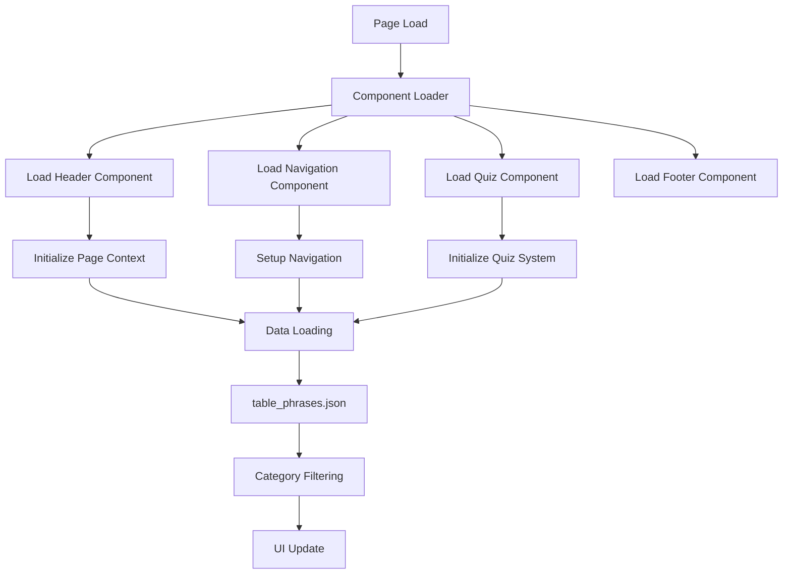

# Архитектура фронтенда

## Обзор

Фронтенд фразеологизмов использует **компонентную архитектуру** с возможностями динамической загрузки, создавая современный, поддерживаемый и производительный пользовательский интерфейс. Система объединяет генерацию статического HTML с клиентскими JavaScript-компонентами для оптимальной производительности и пользовательского опыта.

## Принципы архитектуры

### Компонентный дизайн
- **Модульность**: Переиспользуемые HTML-компоненты для единообразного интерфейса
- **Разделение ответственности**: Отчётливое различие между структурой, стилем и поведением
- **Динамическая загрузка**: Внедрение компонентов на JavaScript
- **Поддерживаемость**: Обновления общих компонентов в одном месте

### Постепенное улучшение
- **Статическая основа**: Подход HTML-first для SEO и доступности
- **JavaScript-улучшение**: Постепенное добавление функций
- **Корректная деградация**: Работа без JavaScript
- **Производительность**: Быстрая первоначальная загрузка с улучшенной интерактивностью

## Core Architecture

### Component System

#### HTML Components (`components/` directory)
Modular HTML fragments loaded dynamically:

```
components/
├── header.html              # Site header with title and description
├── navigation.html           # Main navigation menu and sidebar  
├── footer.html              # Site footer with links and info
├── quiz-content.html        # Interactive quiz interface
├── categories-content.html   # Category selection page
└── seo-content.html         # Search engine optimized content
```

#### Component Loader (`component-loader.js`)
**Dynamic component injection system**

```javascript
class ComponentLoader {
  async loadComponent(componentName, targetSelector) {
    const response = await fetch(`components/${componentName}.html`);
    const html = await response.text();
    document.querySelector(targetSelector).innerHTML = html;
  }
}
```

**Key Features:**
- **Async Loading**: Non-blocking component injection
- **Error Handling**: Graceful fallback for missing components
- **Configuration**: Page-specific component mappings
- **Event System**: Component lifecycle management

### Page Architecture

#### Static Page Structure
**Template-based page generation**

```html
<!DOCTYPE html>
<html lang="ru">
<head>
  <meta charset="UTF-8">
  <meta name="viewport" content="width=device-width, initial-scale=1.0">
  <title>Category Name - Фразеологизмы</title>
  <!-- SEO meta tags -->
</head>
<body>
  <div id="app">
    <!-- Component injection points -->
    <div id="header-container"></div>
    <div id="main-container">
      <div id="navigation-container"></div>
      <div id="content-container">
        <div id="quiz-content"></div>
      </div>
    </div>
    <div id="footer-container"></div>
    <div id="seo-content"></div>
  </div>
  
  <!-- Scripts -->
  <script src="component-loader.js"></script>
  <script src="script.js"></script>
</body>
</html>
```

#### Page Types
1. **Landing Page** (`index.html`): Main entry point with overview
2. **Category Pages** (`frazeologizmy_*.html`): Thematic phrase collections
3. **Categories Overview** (`categories.html`): Category selection interface

### Responsive Design System

#### Breakpoint Strategy
```css
/* Mobile First Approach */
.container {
  width: 100%;
  padding: 1rem;
}

/* Tablet (≥768px) */
@media (min-width: 768px) {
  .container {
    max-width: 750px;
    margin: 0 auto;
  }
}

/* Desktop (≥1024px) */
@media (min-width: 1024px) {
  .main-container {
    display: flex;
    max-width: 1000px;
    margin: 0 auto;
  }
  
  .sidebar {
    width: 250px;
    position: fixed;
  }
  
  .content {
    margin-left: 250px;
    flex: 1;
  }
}
```

#### Layout Patterns
- **Mobile**: Stacked layout with hamburger navigation
- **Tablet**: Two-column layout with collapsible sidebar
- **Desktop**: Fixed sidebar with main content area

## Component Details

### Header Component
**Site branding and page context**

```html
<!-- components/header.html -->
<header class="site-header">
  <div class="header-content">
    <h1 class="site-title">Фразеологизмы</h1>
    <p class="category-description" id="category-description">
      <!-- Dynamic category description -->
    </p>
  </div>
</header>
```

**Features:**
- **Dynamic Titles**: Category-specific page titles
- **Breadcrumbs**: Navigation context
- **Responsive**: Adapts to screen size

### Navigation Component  
**Site navigation and category menu**

```html
<!-- components/navigation.html -->
<nav class="main-navigation" id="main-navigation">
  <div class="nav-header">
    <button class="nav-toggle" id="nav-toggle">
      <span class="hamburger"></span>
    </button>
  </div>
  
  <ul class="nav-menu" id="nav-menu">
    <li><a href="index.html">Главная</a></li>
    <li><a href="categories.html">Все категории</a></li>
    <!-- Dynamic category links -->
  </ul>
</nav>
```

**Features:**
- **Responsive Menu**: Hamburger menu for mobile
- **Category Links**: Dynamic generation from data
- **Active States**: Current page highlighting
- **Keyboard Navigation**: Accessibility support

### Quiz Content Component
**Interactive learning interface**

```html
<!-- components/quiz-content.html -->
<div class="quiz-container">
  <div class="quiz-header">
    <div class="progress-bar">
      <div class="progress-fill" id="progress-fill"></div>
    </div>
    <div class="quiz-stats">
      <span id="current-question">1</span> / 
      <span id="total-questions">50</span>
    </div>
  </div>
  
  <div class="quiz-content">
    <div class="question-section">
      <h2 class="phrase" id="phrase"><!-- Dynamic phrase --></h2>
    </div>
    
    <div class="answers-section">
      <div class="answer-options" id="answer-options">
        <!-- Dynamic answer choices -->
      </div>
    </div>
    
    <div class="feedback-section" id="feedback">
      <!-- Dynamic feedback -->
    </div>
    
    <div class="controls-section">
      <button id="next-button">Следующий вопрос</button>
      <button id="show-etymology">Показать этимологию</button>
    </div>
  </div>
</div>
```

**Features:**
- **Progress Tracking**: Visual progress indicator
- **Interactive Feedback**: Immediate answer validation
- **Etymology Display**: Educational context
- **Responsive Design**: Mobile-optimized interface

## JavaScript Architecture

### Main Application (`script.js`)

#### PhraseologyTrainer Class
**Core quiz functionality**

```javascript
class PhraseologyTrainer {
  constructor() {
    this.phrases = [];
    this.currentQuestion = null;
    this.correctAnswers = 0;
    this.totalQuestions = 0;
    this.usedPhrases = new Set();
  }
  
  async init() {
    await this.loadPhrases();
    this.setupEventListeners();
    this.startNewQuestion();
  }
  
  async loadPhrases() {
    const response = await fetch('table_phrases.json');
    const data = await response.json();
    this.filterPhrasesByCategory(data);
  }
  
  // Additional methods...
}
```

**Key Features:**
- **Data Management**: JSON data loading and processing
- **State Management**: Quiz state and progress tracking
- **Event Handling**: User interaction management
- **Category Filtering**: Dynamic phrase filtering

#### Navigation System (`navigation.js`)
**Site navigation functionality**

```javascript
class NavigationManager {
  constructor() {
    this.isMenuOpen = false;
    this.currentCategory = null;
  }
  
  init() {
    this.setupEventListeners();
    this.generateCategoryMenu();
    this.handleResponsiveNavigation();
  }
  
  generateCategoryMenu() {
    // Dynamic menu generation from categories
  }
  
  handleResponsiveNavigation() {
    // Mobile menu toggle functionality
  }
}
```

### Data Flow Architecture

#### Component Communication


#### State Management
- **Global State**: Application-wide settings and data
- **Component State**: Component-specific state management
- **Local Storage**: Persistent user preferences
- **Session State**: Temporary quiz progress

## Styling Architecture

### CSS Organization
```css
/* Base Styles */
:root {
  --primary-color: #3498db;
  --success-color: #27ae60;
  --error-color: #e74c3c;
  --font-family: 'Inter', -apple-system, BlinkMacSystemFont, sans-serif;
}

/* Layout Components */
.container { /* Base container styles */ }
.grid { /* Grid layout system */ }
.flex { /* Flexbox utilities */ }

/* Component Styles */
.quiz-container { /* Quiz-specific styles */ }
.navigation { /* Navigation styles */ }
.header { /* Header styles */ }

/* Responsive Utilities */
.mobile-only { display: block; }
.desktop-only { display: none; }

@media (min-width: 1024px) {
  .mobile-only { display: none; }
  .desktop-only { display: block; }
}
```

### Design System
- **Typography**: Inter font for readability
- **Color Palette**: Semantic colors for UI states
- **Spacing**: Consistent spacing scale
- **Components**: Reusable UI component styles

## Performance Optimization

### Loading Strategy
- **Critical CSS**: Inline critical styles
- **Component Loading**: Async component injection
- **Data Loading**: Lazy loading of phrase data
- **Image Optimization**: Minimal image usage

### Caching Strategy
```javascript
// Service Worker for component caching
if ('serviceWorker' in navigator) {
  navigator.serviceWorker.register('/sw.js')
    .then(registration => console.log('SW registered'))
    .catch(error => console.log('SW registration failed'));
}
```

### Bundle Optimization
- **No Build Step**: Vanilla JavaScript approach
- **HTTP/2**: Multiple small files instead of bundles
- **Compression**: Gzip-ready static assets
- **CDN**: Static asset distribution

## Accessibility Features

### Semantic HTML
- **Proper Heading Hierarchy**: h1-h6 structure
- **ARIA Labels**: Screen reader support
- **Keyboard Navigation**: Tab-based navigation
- **Focus Management**: Logical focus flow

### Responsive Design
- **Mobile First**: Touch-friendly interface
- **High Contrast**: Readable color combinations
- **Scalable Text**: Responsive typography
- **Screen Reader**: Compatible markup

## Browser Compatibility

### Supported Browsers
- **Modern Browsers**: Chrome 80+, Firefox 75+, Safari 13+, Edge 80+
- **Mobile Browsers**: iOS Safari, Chrome Mobile, Samsung Internet
- **JavaScript Requirements**: ES6+ support required

### Fallback Strategy
```javascript
// Feature detection
if (!window.fetch) {
  // Polyfill or graceful degradation
  console.warn('Fetch API not supported');
}

if (!window.Promise) {
  // Promise polyfill
  loadPolyfill('promise');
}
```

## Development Workflow

### Component Development
1. **Create Component**: Add HTML fragment to `components/`
2. **Update Loader**: Configure component loading
3. **Add Styles**: Component-specific CSS
4. **Test Integration**: Verify component loading
5. **Documentation**: Update component documentation

### Testing Strategy
- **Manual Testing**: Cross-browser verification
- **Responsive Testing**: Multiple device testing
- **Accessibility Testing**: Screen reader testing
- **Performance Testing**: Load time measurement

## Future Enhancements

### Planned Features
- **Progressive Web App**: Service worker implementation
- **Component Framework**: Consider Vue.js or React integration
- **TypeScript**: Type safety for JavaScript
- **Automated Testing**: Unit and integration tests

### Performance Improvements
- **Bundle Optimization**: Webpack or Vite integration
- **Image Optimization**: WebP format support
- **Advanced Caching**: Sophisticated caching strategies
- **Lazy Loading**: Component-level lazy loading

---

*This frontend architecture provides a solid foundation for the educational platform while maintaining flexibility for future enhancements and optimizations.*