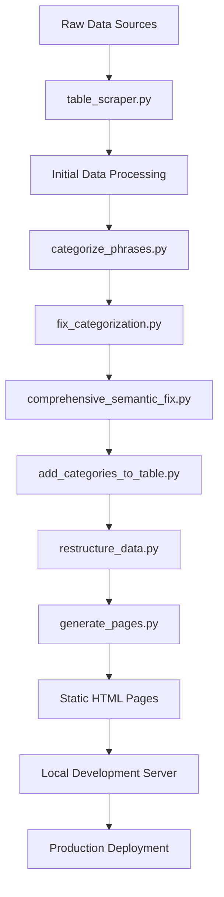

# Project Overview

## What is Frazeologizms?

The **frazeologizms** project is an interactive learning platform dedicated to Russian phraseological units (idioms, expressions, and proverbs). It provides comprehensive educational content including definitions, meanings, etymologies, and semantic categorization of idiomatic expressions.

## Purpose and Goals

### Primary Objectives
- **Educational Resource**: Comprehensive database of Russian idioms with detailed explanations
- **Language Learning**: Interactive platform for students studying Russian phraseology
- **Exam Preparation**: Targeted practice for Russian language exams (EGE/OGÉ)
- **Cultural Understanding**: Insights into Russian culture through idiomatic expressions
- **Research Tool**: Academic resource for linguistic and cultural studies

### Target Audience
- **Language Learners**: Students at various levels studying Russian
- **Exam Candidates**: Preparing for standardized Russian language tests
- **Educators**: Teachers of Russian language and literature
- **Linguists**: Researchers studying phraseology and semantics
- **Cultural Enthusiasts**: Individuals interested in Russian culture

## System Architecture

The platform employs a **hybrid architecture** combining static site generation with dynamic frontend behavior:

### Three-Layer Architecture

#### 1. Data Layer
- **JSON Storage**: `table_phrases.json` as primary data source
- **Category Definitions**: Semantic categorization metadata
- **Correction Reports**: Automated quality improvements
- **Multiple Versions**: Original, fixed, and semantically enhanced datasets

#### 2. Processing Layer
- **Python Scripts**: Automated data processing pipeline
- **Categorization Engine**: Semantic classification system
- **Quality Validation**: Error detection and correction
- **Page Generation**: Static HTML creation

#### 3. Presentation Layer
- **Static HTML Pages**: SEO-friendly category pages
- **Component System**: Modular HTML components
- **Interactive JavaScript**: Quiz functionality and navigation
- **Responsive Design**: Mobile-friendly interface

## Core Components

### Data Structure
The foundation is `table_phrases.json` containing:
- **Categories**: 20+ semantic categories with descriptions and keywords
- **Phrases**: 10,000+ phraseological units with:
  - Original phrase text
  - Multiple meaning definitions
  - Etymology and historical context
  - Semantic category assignment

### Processing Scripts
- **`categorize_phrases.py`**: Initial keyword-based categorization
- **`fix_categorization.py`**: Manual correction rules
- **`comprehensive_semantic_fix.py`**: Advanced semantic analysis
- **`add_categories_to_table.py`**: Category metadata integration
- **`restructure_data.py`**: Data optimization for frontend
- **`table_scraper.py`**: External data extraction
- **`generate_pages.py`**: Static page generation

### Frontend Components
- **Component-based Architecture**: Reusable HTML fragments
- **Dynamic Loading**: JavaScript-powered component system
- **Interactive Quiz**: PhraseologyTrainer class
- **Navigation System**: Category browsing and filtering
- **Responsive Design**: Cross-device compatibility

## Data Processing Pipeline

## Key Features

### 🧠 Semantic Categorization Engine
- **Meaning-Based Classification**: Categories based on complete phrase semantics
- **Automated Correction**: AI-powered validation of categorization
- **Quality Assurance**: 401 corrections applied in latest version
- **Flexible Taxonomy**: 20+ thematic categories

### 🎮 Interactive Quiz System
- **Category Filtering**: Practice specific thematic groups
- **Non-Repeating Questions**: Intelligent question selection
- **Immediate Feedback**: Explanations for correct and incorrect answers
- **Progress Tracking**: Statistics and performance monitoring
- **Etymology Display**: Historical context for learning

### 📱 Responsive Web Platform
- **Mobile-First Design**: Optimized for all devices
- **Component-Based UI**: Consistent and maintainable interface
- **SEO Optimization**: Search engine friendly structure
- **Fast Loading**: Static site performance

### 🔄 Automated Workflow
- **Data Pipeline**: Fully automated processing
- **Quality Control**: Built-in validation and correction
- **Page Generation**: Automatic HTML creation
- **Development Server**: Local testing environment

## Development Workflow

### Standard Development Process
1. **Data Updates**: Modify source JSON files
2. **Run Processing Pipeline**: Execute Python scripts in sequence
3. **Generate Static Pages**: Create updated HTML files
4. **Local Testing**: Verify changes with development server
5. **Deployment**: Publish updated static site

### Quality Assurance
- **Semantic Validation**: Automated categorization verification
- **Data Integrity**: Consistency checks across datasets
- **Performance Testing**: Load time and responsiveness validation
- **Cross-Browser Testing**: Compatibility verification

## Use Cases

### Language Education
- **Vocabulary Building**: Thematic exploration of idioms
- **Cultural Context**: Understanding Russian mindset through expressions
- **Progressive Learning**: Structured difficulty levels
- **Retention Testing**: Quiz-based knowledge reinforcement

### Exam Preparation
- **EGE/OGÉ Practice**: Targeted exercises for standardized tests
- **Comprehensive Coverage**: Broad spectrum of phraseological units
- **Performance Tracking**: Progress monitoring and weak area identification
- **Efficient Study**: Focused practice on specific categories

### Academic Research
- **Semantic Analysis**: Study of meaning relationships
- **Cultural Studies**: Exploration of Russian cultural themes
- **Linguistic Research**: Phraseological pattern analysis
- **Comparative Studies**: Cross-cultural idiom comparison

## Technical Benefits

### Performance
- **Static Site Generation**: Fast loading times
- **CDN-Ready**: Easy deployment to content delivery networks
- **Minimal Server Requirements**: Low hosting costs
- **Offline Capability**: Local development and testing

### Maintainability
- **Modular Architecture**: Separatation of concerns
- **Automated Processing**: Reduced manual effort
- **Version Control**: Git-based development workflow
- **Documentation**: Comprehensive project documentation

### Scalability
- **Data-Driven**: Easy addition of new phrases and categories
- **Component-Based**: Reusable UI elements
- **Extensible Architecture**: Support for new features
- **Multi-Language Ready**: Framework for internationalization

---

*This overview provides the foundation for understanding the frazeologizms project. For detailed technical information, see the specific documentation sections.*