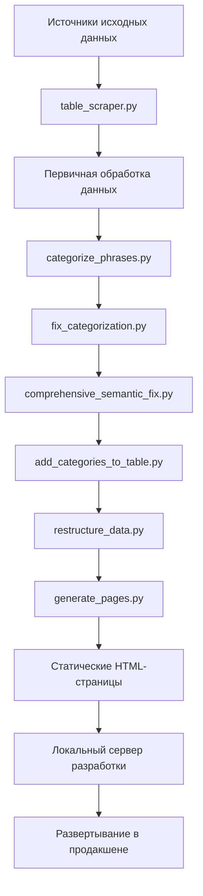

# Обзор проекта

## Что такое Фразеологизмы?

Проект **фразеологизмы** — это интерактивная обучающая платформа, посвящённая русским фразеологическим единицам (идиомам, выражениям и пословицам). Она предоставляет комплексный образовательный контент, включая определения, значения, этимологию и семантическую категоризацию идиоматических выражений.

## Цели и задачи

### Основные цели
- **Образовательный ресурс**: Комплексная база данных русских идиом с подробными объяснениями
- **Изучение языка**: Интерактивная платформа для студентов, изучающих русскую фразеологию
- **Подготовка к экзаменам**: Целенаправленная практика для экзаменов по русскому языку (ЕГЭ/ОГЭ)
- **Культурное понимание**: Понимание русской культуры через идиоматические выражения
- **Инструмент для исследований**: Академический ресурс для лингвистических и культурных исследований

### Целевая аудитория
- **Изучающие язык**: Студенты различных уровней, изучающие русский язык
- **Кандидаты на экзамены**: Готовящиеся к стандартизированным тестам по русскому языку
- **Преподаватели**: Учителя русского языка и литературы
- **Лингвисты**: Исследователи, изучающие фразеологию и семантику
- **Любители культуры**: Лица, интересующиеся русской культурой

## Системная архитектура

Платформа использует **гибридную архитектуру**, сочетающую генерацию статических сайтов с динамическим поведением фронтенда:

### Трёхслойная архитектура

#### 1. Слой данных
- **Хранение JSON**: `table_phrases.json` как основной источник данных
- **Определения категорий**: Метаданные семантической категоризации
- **Отчёты о коррекциях**: Автоматические улучшения качества
- **Множественные версии**: Оригинальные, исправленные и семантически улучшенные наборы данных

#### 2. Слой обработки
- **Python-скрипты**: Автоматизированный конвейер обработки данных
- **Движок категоризации**: Система семантической классификации
- **Валидация качества**: Обнаружение и исправление ошибок
- **Генерация страниц**: Создание статического HTML

#### 3. Слой представления
- **Статические HTML-страницы**: SEO-дружественные страницы категорий
- **Компонентная система**: Модульные HTML-компоненты
- **Интерактивный JavaScript**: Функциональность викторин и навигация
- **Адаптивный дизайн**: Интерфейс, оптимизированный для мобильных устройств

## Основные компоненты

### Структура данных
Основа — файл `table_phrases.json`, содержащий:
- **Категории**: 20+ семантических категорий с описаниями и ключевыми словами
- **Фразы**: 10 000+ фразеологических единиц с:
  - Оригинальным текстом фразы
  - Множественными определениями значений
  - Этимологией и историческим контекстом
  - Назначением семантической категории

### Скрипты обработки
- **`categorize_phrases.py`**: Первоначальная категоризация на основе ключевых слов
- **`fix_categorization.py`**: Правила ручной коррекции
- **`comprehensive_semantic_fix.py`**: Продвинутый семантический анализ
- **`add_categories_to_table.py`**: Интеграция метаданных категорий
- **`restructure_data.py`**: Оптимизация данных для фронтенда
- **`table_scraper.py`**: Извлечение внешних данных
- **`generate_pages.py`**: Генерация статических страниц

### Компоненты фронтенда
- **Компонентная архитектура**: Переиспользуемые HTML-фрагменты
- **Динамическая загрузка**: Система компонентов на JavaScript
- **Интерактивная викторина**: Класс PhraseologyTrainer
- **Система навигации**: Просмотр и фильтрация по категориям
- **Адаптивный дизайн**: Совместимость с различными устройствами

## Конвейер обработки данных

## Ключевые особенности

### 🧠 Движок семантической категоризации
- **Классификация на основе значений**: Категории, основанные на полной семантике фраз
- **Автоматическая коррекция**: Валидация категоризации на основе ИИ
- **Контроль качества**: 401 исправление применено в последней версии
- **Гибкая таксономия**: 20+ тематических категорий

### 🎮 Интерактивная система викторин
- **Фильтрация по категориям**: Практика определённых тематических групп
- **Неповторяющиеся вопросы**: Интеллектуальный выбор вопросов
- **Немедленная обратная связь**: Объяснения правильных и неправильных ответов
- **Отслеживание прогресса**: Статистика и мониторинг успеваемости
- **Отображение этимологии**: Исторический контекст для обучения

### 📱 Адаптивная веб-платформа
- **Дизайн для мобильных устройств**: Оптимизирован для всех устройств
- **Компонентный интерфейс**: Последовательный и поддерживаемый интерфейс
- **SEO-оптимизация**: Структура, дружественная к поисковым системам
- **Быстрая загрузка**: Производительность статического сайта

### 🔄 Автоматизированный рабочий процесс
- **Конвейер данных**: Полностью автоматизированная обработка
- **Контроль качества**: Встроенная валидация и коррекция
- **Генерация страниц**: Автоматическое создание HTML
- **Сервер разработки**: Локальная среда тестирования

## Рабочий процесс разработки

### Стандартный процесс разработки
1. **Обновления данных**: Изменение исходных JSON-файлов
2. **Запуск конвейера обработки**: Последовательное выполнение Python-скриптов
3. **Генерация статических страниц**: Создание обновлённых HTML-файлов
4. **Локальное тестирование**: Проверка изменений с помощью сервера разработки
5. **Развёртывание**: Публикация обновлённого статического сайта

### Контроль качества
- **Семантическая валидация**: Автоматическая проверка категоризации
- **Целостность данных**: Проверки согласованности по наборам данных
- **Тестирование производительности**: Валидация времени загрузки и отзывчивости
- **Кроссбраузерное тестирование**: Проверка совместимости

## Случаи использования

### Языковое образование
- **Расширение словарного запаса**: Тематическое изучение идиом
- **Культурный контекст**: Понимание русского менталитета через выражения
- **Прогрессивное обучение**: Структурированные уровни сложности
- **Тестирование запоминания**: Закрепление знаний на основе викторин

### Подготовка к экзаменам
- **Практика ЕГЭ/ОГЭ**: Целенаправленные упражнения для стандартизированных тестов
- **Комплексное покрытие**: Широкий спектр фразеологических единиц
- **Отслеживание успеваемости**: Мониторинг прогресса и выявление слабых мест
- **Эффективное изучение**: Целенаправленная практика по определённым категориям

### Академические исследования
- **Семантический анализ**: Изучение взаимосвязей значений
- **Культурологические исследования**: Изучение русских культурных тем
- **Лингвистические исследования**: Анализ фразеологических паттернов
- **Сравнительные исследования**: Сравнение идиом разных культур

## Технические преимущества

### Производительность
- **Генерация статических сайтов**: Быстрое время загрузки
- **Готовность к CDN**: Простое развёртывание в сетях доставки контента
- **Минимальные требования к серверу**: Низкие затраты на хостинг
- **Автономные возможности**: Локальная разработка и тестирование

### Поддерживаемость
- **Модульная архитектура**: Разделение ответственности
- **Автоматизированная обработка**: Снижение ручных усилий
- **Контроль версий**: Рабочий процесс разработки на основе Git
- **Документация**: Комплексная документация проекта

### Масштабируемость
- **Управляемость данными**: Простое добавление новых фраз и категорий
- **Компонентная основа**: Переиспользуемые элементы интерфейса
- **Расширяемая архитектура**: Поддержка новых функций
- **Готовность к многоязычности**: Фреймворк для интернационализации

---

*Этот обзор предоставляет основу для понимания проекта фразеологизмы. Для получения подробной технической информации смотрите соответствующие разделы документации.*