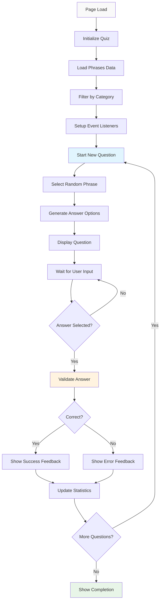

# Quiz Functionality

## Overview

The quiz system is the core interactive component of the frazeologizms platform, providing an engaging way for users to learn and test their knowledge of Russian phraseological units. Built around the `PhraseologyTrainer` class, it offers category-based learning, progress tracking, and immediate feedback.

## Core Architecture

### PhraseologyTrainer Class
**Main quiz engine in `script.js`**

```javascript
class PhraseologyTrainer {
  constructor() {
    this.phrases = [];           // Category-filtered phrases
    this.allPhrases = [];        // Complete phrase dataset
    this.currentQuestion = null; // Current quiz question
    this.correctAnswers = 0;     // Score tracking
    this.totalQuestions = 0;     // Question counter
    this.usedPhrases = new Set(); // Non-repeating selection
  }
}
```

### Quiz Lifecycle



## Data Management

### Phrase Loading and Filtering

#### Data Source Integration
```javascript
async loadPhrases() {
  try {
    const response = await fetch('table_phrases.json');
    const data = await response.json();
    
    // Get category from URL or global variable
    const currentCategory = window.CURRENT_CATEGORY || this.getCategoryFromURL();
    
    // Filter phrases by category
    const allValidPhrases = data.phrases.filter(phrase => {
      return phrase.meanings && 
             phrase.meanings.length > 0 && 
             phrase.meanings[0] !== "Значение требует уточнения" &&
             phrase.meanings[0].trim().length > 10;
    });
    
    if (currentCategory && currentCategory !== 'general') {
      this.phrases = allValidPhrases.filter(phrase => 
        phrase.category === currentCategory
      );
    } else {
      this.phrases = allValidPhrases;
    }
    
    this.allPhrases = allValidPhrases;
  } catch (error) {
    this.showError(error);
  }
}
```

#### Category Detection
```javascript
getCategoryFromURL() {
  const path = window.location.pathname;
  const filename = path.split('/').pop() || 'index.html';
  
  // Map filenames to categories
  const urlCategoryMap = {
    'frazeologizmy_animals.html': 'animals',
    'frazeologizmy_emotions.html': 'emotions_feelings',
    'frazeologizmy_work.html': 'work_labor',
    // ... additional mappings
  };
  
  return urlCategoryMap[filename] || 'general';
}
```

## Question Generation

### Non-Repeating Selection Algorithm

#### Smart Phrase Selection
```javascript
startNewQuestion() {
  // Check completion condition
  if (this.usedPhrases.size >= this.phrases.length) {
    this.showGameComplete();
    return;
  }
  
  // Filter unused phrases
  const availablePhrases = this.phrases.filter(phrase => 
    !this.usedPhrases.has(phrase.phrase)
  );
  
  // Random selection
  const randomIndex = Math.floor(Math.random() * availablePhrases.length);
  const selectedPhrase = availablePhrases[randomIndex];
  
  this.currentQuestion = selectedPhrase;
  this.usedPhrases.add(selectedPhrase.phrase);
  
  this.displayQuestion();
  this.generateAnswerOptions();
}
```

### Answer Option Generation

#### Multiple Choice Creation
```javascript
generateAnswerOptions() {
  const correctMeaning = this.getRandomMeaning(this.currentQuestion);
  const incorrectMeanings = this.getRandomIncorrectMeanings(correctMeaning, 2);
  
  // Combine and shuffle options
  const allOptions = [correctMeaning, ...incorrectMeanings];
  const shuffledOptions = this.shuffleArray(allOptions);
  
  this.displayAnswerOptions(shuffledOptions, correctMeaning);
}

getRandomIncorrectMeanings(correctMeaning, count) {
  const incorrectMeanings = [];
  const availablePhrases = [...this.allPhrases];
  
  while (incorrectMeanings.length < count && availablePhrases.length > 0) {
    const randomPhrase = availablePhrases.splice(
      Math.floor(Math.random() * availablePhrases.length), 1
    )[0];
    
    const meaning = this.getRandomMeaning(randomPhrase);
    
    if (meaning !== correctMeaning && 
        !incorrectMeanings.includes(meaning) &&
        meaning !== "Значение недоступно") {
      incorrectMeanings.push(meaning);
    }
  }
  
  // Fallback generic meanings if needed
  while (incorrectMeanings.length < count) {
    const genericMeanings = [
      "выражение радости или удовлетворения",
      "обозначение быстрого движения или действия",
      "описание сложной или запутанной ситуации"
    ];
    
    const unusedGeneric = genericMeanings.find(meaning => 
      !incorrectMeanings.includes(meaning) && meaning !== correctMeaning
    );
    
    if (unusedGeneric) {
      incorrectMeanings.push(unusedGeneric);
    } else {
      break;
    }
  }
  
  return incorrectMeanings;
}
```

## User Interface

### Question Display

#### Dynamic Content Rendering
```javascript
displayQuestion() {
  const phraseElement = document.getElementById('phrase');
  phraseElement.textContent = this.currentQuestion.phrase;
  
  // Update progress
  this.updateProgress();
  
  // Reset UI state
  this.resetUIState();
}

updateProgress() {
  const currentElement = document.getElementById('current-question');
  const totalElement = document.getElementById('total-questions');
  
  currentElement.textContent = this.usedPhrases.size;
  totalElement.textContent = this.phrases.length;
  
  // Update progress bar
  const progressBar = document.getElementById('progress-fill');
  const percentage = (this.usedPhrases.size / this.phrases.length) * 100;
  progressBar.style.width = `${percentage}%`;
}
```

#### Answer Option Interface
```javascript
displayAnswerOptions(options, correctMeaning) {
  const container = document.getElementById('answer-options');
  container.innerHTML = '';
  
  options.forEach((option, index) => {
    const button = document.createElement('button');
    button.className = 'answer-option';
    button.textContent = option;
    button.addEventListener('click', () => {
      this.handleAnswerSelection(option, correctMeaning, button);
    });
    
    container.appendChild(button);
  });
}
```

### Feedback System

#### Immediate Response Handling
```javascript
handleAnswerSelection(selectedAnswer, correctAnswer, buttonElement) {
  const isCorrect = selectedAnswer === correctAnswer;
  
  // Update statistics
  this.totalQuestions++;
  if (isCorrect) {
    this.correctAnswers++;
  }
  
  // Visual feedback
  this.showAnswerFeedback(isCorrect, buttonElement, correctAnswer);
  
  // Disable further selections
  this.disableAnswerOptions();
  
  // Show controls
  this.showQuizControls();
}

showAnswerFeedback(isCorrect, buttonElement, correctAnswer) {
  const feedbackDiv = document.getElementById('feedback');
  
  if (isCorrect) {
    buttonElement.classList.add('correct');
    feedbackDiv.innerHTML = `
      <div class="feedback-message success">
        <strong>Правильно!</strong> 
        ${this.getEncouragement()}
      </div>
    `;
  } else {
    buttonElement.classList.add('incorrect');
    this.highlightCorrectAnswer(correctAnswer);
    
    feedbackDiv.innerHTML = `
      <div class="feedback-message error">
        <strong>Неправильно.</strong> 
        Правильный ответ: <em>${correctAnswer}</em>
      </div>
    `;
  }
  
  feedbackDiv.style.display = 'block';
}
```

## Progress Tracking

### Statistics Management

#### Real-time Progress Updates
```javascript
updateStatistics() {
  const accuracy = this.totalQuestions > 0 ? 
    Math.round((this.correctAnswers / this.totalQuestions) * 100) : 0;
  
  // Update progress display
  document.getElementById('correct-count').textContent = this.correctAnswers;
  document.getElementById('total-count').textContent = this.totalQuestions;
  document.getElementById('accuracy').textContent = `${accuracy}%`;
  
  // Update progress bar color based on performance
  const progressBar = document.getElementById('progress-fill');
  if (accuracy >= 80) {
    progressBar.className = 'progress-fill excellent';
  } else if (accuracy >= 60) {
    progressBar.className = 'progress-fill good';
  } else {
    progressBar.className = 'progress-fill needs-improvement';
  }
}
```

### Completion Detection

#### Game End Handling
```javascript
showGameComplete() {
  const accuracy = Math.round((this.correctAnswers / this.totalQuestions) * 100);
  
  const completionMessage = this.getCompletionMessage(accuracy);
  const performanceLevel = this.getPerformanceLevel(accuracy);
  
  document.getElementById('quiz-content').innerHTML = `
    <div class="completion-screen">
      <h2>Викторина завершена!</h2>
      <div class="final-statistics">
        <div class="stat-item">
          <span class="stat-label">Правильных ответов:</span>
          <span class="stat-value">${this.correctAnswers} из ${this.totalQuestions}</span>
        </div>
        <div class="stat-item">
          <span class="stat-label">Точность:</span>
          <span class="stat-value ${performanceLevel}">${accuracy}%</span>
        </div>
      </div>
      <div class="completion-message ${performanceLevel}">
        ${completionMessage}
      </div>
      <button id="restart-quiz" class="primary-button">
        Начать заново
      </button>
    </div>
  `;
  
  // Setup restart functionality
  document.getElementById('restart-quiz').addEventListener('click', () => {
    this.restart();
  });
}

getCompletionMessage(accuracy) {
  if (accuracy >= 90) return "Отлично! У вас превосходное знание фразеологизмов!";
  if (accuracy >= 80) return "Очень хорошо! Вы хорошо знаете фразеологизмы!";
  if (accuracy >= 70) return "Хорошо! Продолжайте изучать фразеологизмы!";
  if (accuracy >= 60) return "Неплохо! Есть над чем поработать.";
  return "Нужно больше практики. Попробуйте еще раз!";
}
```

## Educational Features

### Etymology Display

#### Contextual Learning
```javascript
toggleEtymology() {
  const etymologyDiv = document.getElementById('etymology-info');
  const etymology = this.currentQuestion.etymology;
  
  if (etymology && etymology.trim() !== '') {
    etymologyDiv.innerHTML = `
      <div class="etymology-content">
        <h4>Этимология:</h4>
        <p>${etymology}</p>
      </div>
    `;
    etymologyDiv.style.display = 'block';
  } else {
    etymologyDiv.innerHTML = `
      <div class="etymology-content">
        <p><em>Этимология для этого фразеологизма не указана.</em></p>
      </div>
    `;
    etymologyDiv.style.display = 'block';
  }
}
```

### Adaptive Difficulty

#### Smart Question Selection
```javascript
getRandomMeaning(phrase) {
  if (!phrase.meanings || phrase.meanings.length === 0) {
    return "Значение недоступно";
  }
  
  // Prefer primary meaning, but allow variety
  if (phrase.meanings.length === 1) {
    return phrase.meanings[0];
  }
  
  // Weighted selection favoring primary meaning
  const randomChoice = Math.random();
  if (randomChoice < 0.7) {
    return phrase.meanings[0]; // Primary meaning (70% chance)
  } else {
    const alternativeIndex = Math.floor(Math.random() * (phrase.meanings.length - 1)) + 1;
    return phrase.meanings[alternativeIndex];
  }
}
```

## Error Handling

### Robust Error Management

#### Data Loading Errors
```javascript
showError(error) {
  console.error('Quiz initialization error:', error);
  
  const errorMessage = `
    <div class="error-screen">
      <h2>Ошибка загрузки</h2>
      <p>Не удалось загрузить данные для викторины.</p>
      <div class="error-details">
        <p><strong>Возможные причины:</strong></p>
        <ul>
          <li>Проблемы с сетевым подключением</li>
          <li>Файл данных недоступен</li>
          <li>Браузер блокирует загрузку файлов</li>
        </ul>
      </div>
      <button onclick="location.reload()" class="retry-button">
        Попробовать снова
      </button>
    </div>
  `;
  
  document.getElementById('quiz-content').innerHTML = errorMessage;
  document.getElementById('loading').style.display = 'none';
}
```

## Performance Optimization

### Efficient Data Handling

#### Memory Management
```javascript
// Optimize memory usage for large datasets
filterPhrasesByCategory(data) {
  // Only keep necessary phrase data
  this.phrases = data.phrases
    .filter(this.isValidPhrase)
    .map(phrase => ({
      phrase: phrase.phrase,
      meanings: phrase.meanings,
      etymology: phrase.etymology || '',
      category: phrase.category
    }));
}

isValidPhrase(phrase) {
  return phrase.meanings && 
         phrase.meanings.length > 0 && 
         phrase.meanings[0] !== "Значение требует уточнения" &&
         phrase.meanings[0].trim().length > 10;
}
```

### UI Performance
```javascript
// Efficient DOM updates
updateUIElement(elementId, content) {
  const element = document.getElementById(elementId);
  if (element && element.textContent !== content) {
    element.textContent = content;
  }
}

// Batch DOM operations
batchUIUpdates(updates) {
  requestAnimationFrame(() => {
    updates.forEach(update => {
      const element = document.getElementById(update.id);
      if (element) {
        element.textContent = update.content;
      }
    });
  });
}
```

## Accessibility Features

### Keyboard Navigation
```javascript
setupKeyboardNavigation() {
  document.addEventListener('keydown', (event) => {
    if (event.key >= '1' && event.key <= '3') {
      const optionIndex = parseInt(event.key) - 1;
      const options = document.querySelectorAll('.answer-option');
      if (options[optionIndex] && !options[optionIndex].disabled) {
        options[optionIndex].click();
      }
    }
    
    if (event.key === 'Enter' || event.key === ' ') {
      const nextButton = document.getElementById('next-button');
      if (nextButton && nextButton.style.display !== 'none') {
        nextButton.click();
      }
    }
  });
}
```

### Screen Reader Support
```html
<!-- Accessible quiz interface -->
<div class="quiz-container" role="main" aria-live="polite">
  <div class="question-section">
    <h2 class="phrase" id="phrase" aria-label="Фразеологизм для определения"></h2>
  </div>
  
  <div class="answers-section" role="group" aria-labelledby="question-prompt">
    <p id="question-prompt">Выберите правильное значение:</p>
    <div class="answer-options" role="radiogroup">
      <!-- Dynamic answer buttons with proper ARIA labels -->
    </div>
  </div>
</div>
```

## Future Enhancements

### Planned Features
- **Difficulty Levels**: Adaptive questioning based on user performance
- **Spaced Repetition**: Review of previously incorrect answers
- **Custom Categories**: User-defined phrase collections
- **Progress Persistence**: Save and restore quiz progress
- **Multiplayer Mode**: Competitive quiz functionality

### Technical Improvements
- **Offline Support**: Service worker for offline quiz capability
- **Advanced Analytics**: Detailed learning analytics
- **Performance Monitoring**: Quiz performance metrics
- **A/B Testing**: Interface optimization experiments

---

*The quiz system provides an engaging and educational way to learn Russian phraseological units while maintaining high performance and accessibility standards.*