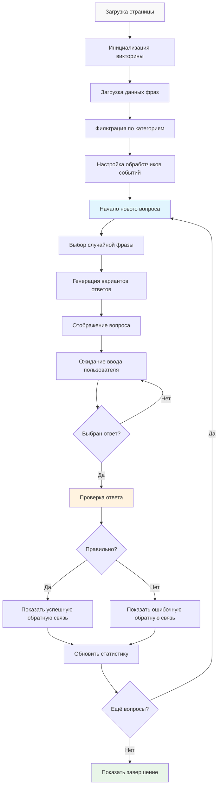

# Функциональность викторины

## Обзор

Система викторины является основным интерактивным компонентом платформы фразеологизмов, предоставляющим увлекательный способ для пользователей изучать и тестировать свои знания русских фразеологических единиц. Построенная вокруг класса `PhraseologyTrainer`, она предлагает обучение на основе категорий, отслеживание прогресса и немедленную обратную связь.

## Основная архитектура

### Класс PhraseologyTrainer
**Основной движок викторины в `script.js`**

```javascript
class PhraseologyTrainer {
  constructor() {
    this.phrases = [];           // Фразы, отфильтрованные по категориям
    this.allPhrases = [];        // Полный набор данных фраз
    this.currentQuestion = null; // Текущий вопрос викторины
    this.correctAnswers = 0;     // Отслеживание счёта
    this.totalQuestions = 0;     // Счётчик вопросов
    this.usedPhrases = new Set(); // Выбор без повторений
  }
}
```

### Жизненный цикл викторины



## Управление данными

### Загрузка и фильтрация фраз

#### Интеграция источника данных
```javascript
async loadPhrases() {
  try {
    const response = await fetch('table_phrases.json');
    const data = await response.json();
    
    // Получить категорию из URL или глобальной переменной
    const currentCategory = window.CURRENT_CATEGORY || this.getCategoryFromURL();
    
    // Фильтровать фразы по категориям
    const allValidPhrases = data.phrases.filter(phrase => {
      return phrase.meanings && 
             phrase.meanings.length > 0 && 
             phrase.meanings[0] !== "Значение требует уточнения" &&
             phrase.meanings[0].trim().length > 10;
    });
    
    if (currentCategory && currentCategory !== 'general') {
      this.phrases = allValidPhrases.filter(phrase => 
        phrase.category === currentCategory
      );
    } else {
      this.phrases = allValidPhrases;
    }
    
    this.allPhrases = allValidPhrases;
  } catch (error) {
    this.showError(error);
  }
}
```

#### Обнаружение категории
```javascript
getCategoryFromURL() {
  const path = window.location.pathname;
  const filename = path.split('/').pop() || 'index.html';
  
  // Сопоставление имён файлов с категориями
  const urlCategoryMap = {
    'frazeologizmy_animals.html': 'animals',
    'frazeologizmy_emotions.html': 'emotions_feelings',
    'frazeologizmy_work.html': 'work_labor',
    // ... дополнительные сопоставления
  };
  
  return urlCategoryMap[filename] || 'general';
}
```

## Генерация вопросов

### Алгоритм выбора без повторений

#### Интеллектуальный выбор фраз
```javascript
startNewQuestion() {
  // Проверить условие завершения
  if (this.usedPhrases.size >= this.phrases.length) {
    this.showGameComplete();
    return;
  }
  
  // Фильтровать неиспользованные фразы
  const availablePhrases = this.phrases.filter(phrase => 
    !this.usedPhrases.has(phrase.phrase)
  );
  
  // Случайный выбор
  const randomIndex = Math.floor(Math.random() * availablePhrases.length);
  const selectedPhrase = availablePhrases[randomIndex];
  
  this.currentQuestion = selectedPhrase;
  this.usedPhrases.add(selectedPhrase.phrase);
  
  this.displayQuestion();
  this.generateAnswerOptions();
}
```

### Генерация вариантов ответов

#### Создание множественного выбора
```javascript
generateAnswerOptions() {
  const correctMeaning = this.getRandomMeaning(this.currentQuestion);
  const incorrectMeanings = this.getRandomIncorrectMeanings(correctMeaning, 2);
  
  // Объединить и перемешать варианты
  const allOptions = [correctMeaning, ...incorrectMeanings];
  const shuffledOptions = this.shuffleArray(allOptions);
  
  this.displayAnswerOptions(shuffledOptions, correctMeaning);
}

getRandomIncorrectMeanings(correctMeaning, count) {
  const incorrectMeanings = [];
  const availablePhrases = [...this.allPhrases];
  
  while (incorrectMeanings.length < count && availablePhrases.length > 0) {
    const randomPhrase = availablePhrases.splice(
      Math.floor(Math.random() * availablePhrases.length), 1
    )[0];
    
    const meaning = this.getRandomMeaning(randomPhrase);
    
    if (meaning !== correctMeaning && 
        !incorrectMeanings.includes(meaning) &&
        meaning !== "Значение недоступно") {
      incorrectMeanings.push(meaning);
    }
  }
  
  // Резервные общие значения при необходимости
  while (incorrectMeanings.length < count) {
    const genericMeanings = [
      "выражение радости или удовлетворения",
      "обозначение быстрого движения или действия",
      "описание сложной или запутанной ситуации"
    ];
    
    const unusedGeneric = genericMeanings.find(meaning => 
      !incorrectMeanings.includes(meaning) && meaning !== correctMeaning
    );
    
    if (unusedGeneric) {
      incorrectMeanings.push(unusedGeneric);
    } else {
      break;
    }
  }
  
  return incorrectMeanings;
}
```

## Пользовательский интерфейс

### Отображение вопросов

#### Динамическое отображение контента
```javascript
displayQuestion() {
  const phraseElement = document.getElementById('phrase');
  phraseElement.textContent = this.currentQuestion.phrase;
  
  // Обновить прогресс
  this.updateProgress();
  
  // Сбросить состояние интерфейса
  this.resetUIState();
}

updateProgress() {
  const currentElement = document.getElementById('current-question');
  const totalElement = document.getElementById('total-questions');
  
  currentElement.textContent = this.usedPhrases.size;
  totalElement.textContent = this.phrases.length;
  
  // Обновить индикатор прогресса
  const progressBar = document.getElementById('progress-fill');
  const percentage = (this.usedPhrases.size / this.phrases.length) * 100;
  progressBar.style.width = `${percentage}%`;
}
```

#### Интерфейс вариантов ответов
```javascript
displayAnswerOptions(options, correctMeaning) {
  const container = document.getElementById('answer-options');
  container.innerHTML = '';
  
  options.forEach((option, index) => {
    const button = document.createElement('button');
    button.className = 'answer-option';
    button.textContent = option;
    button.addEventListener('click', () => {
      this.handleAnswerSelection(option, correctMeaning, button);
    });
    
    container.appendChild(button);
  });
}
```

### Система обратной связи

#### Обработка немедленного ответа
```javascript
handleAnswerSelection(selectedAnswer, correctAnswer, buttonElement) {
  const isCorrect = selectedAnswer === correctAnswer;
  
  // Обновить статистику
  this.totalQuestions++;
  if (isCorrect) {
    this.correctAnswers++;
  }
  
  // Визуальная обратная связь
  this.showAnswerFeedback(isCorrect, buttonElement, correctAnswer);
  
  // Отключить дальнейшие выборы
  this.disableAnswerOptions();
  
  // Показать элементы управления
  this.showQuizControls();
}

showAnswerFeedback(isCorrect, buttonElement, correctAnswer) {
  const feedbackDiv = document.getElementById('feedback');
  
  if (isCorrect) {
    buttonElement.classList.add('correct');
    feedbackDiv.innerHTML = `
      <div class="feedback-message success">
        <strong>Правильно!</strong> 
        ${this.getEncouragement()}
      </div>
    `;
  } else {
    buttonElement.classList.add('incorrect');
    this.highlightCorrectAnswer(correctAnswer);
    
    feedbackDiv.innerHTML = `
      <div class="feedback-message error">
        <strong>Неправильно.</strong> 
        Правильный ответ: <em>${correctAnswer}</em>
      </div>
    `;
  }
  
  feedbackDiv.style.display = 'block';
}
```

## Отслеживание прогресса

### Управление статистикой

#### Обновления статистики в реальном времени
```javascript
updateStatistics() {
  const accuracy = this.totalQuestions > 0 ? 
    Math.round((this.correctAnswers / this.totalQuestions) * 100) : 0;
  
  // Обновить отображение прогресса
  document.getElementById('correct-count').textContent = this.correctAnswers;
  document.getElementById('total-count').textContent = this.totalQuestions;
  document.getElementById('accuracy').textContent = `${accuracy}%`;
  
  // Обновить цвет индикатора прогресса на основе производительности
  const progressBar = document.getElementById('progress-fill');
  if (accuracy >= 80) {
    progressBar.className = 'progress-fill excellent';
  } else if (accuracy >= 60) {
    progressBar.className = 'progress-fill good';
  } else {
    progressBar.className = 'progress-fill needs-improvement';
  }
}
```

### Обнаружение завершения

#### Обработка окончания игры
```javascript
showGameComplete() {
  const accuracy = Math.round((this.correctAnswers / this.totalQuestions) * 100);
  
  const completionMessage = this.getCompletionMessage(accuracy);
  const performanceLevel = this.getPerformanceLevel(accuracy);
  
  document.getElementById('quiz-content').innerHTML = `
    <div class="completion-screen">
      <h2>Викторина завершена!</h2>
      <div class="final-statistics">
        <div class="stat-item">
          <span class="stat-label">Правильных ответов:</span>
          <span class="stat-value">${this.correctAnswers} из ${this.totalQuestions}</span>
        </div>
        <div class="stat-item">
          <span class="stat-label">Точность:</span>
          <span class="stat-value ${performanceLevel}">${accuracy}%</span>
        </div>
      </div>
      <div class="completion-message ${performanceLevel}">
        ${completionMessage}
      </div>
      <button id="restart-quiz" class="primary-button">
        Начать заново
      </button>
    </div>
  `;
  
  // Настройка функциональности перезапуска
  document.getElementById('restart-quiz').addEventListener('click', () => {
    this.restart();
  });
}

getCompletionMessage(accuracy) {
  if (accuracy >= 90) return "Отлично! У вас превосходное знание фразеологизмов!";
  if (accuracy >= 80) return "Очень хорошо! Вы хорошо знаете фразеологизмы!";
  if (accuracy >= 70) return "Хорошо! Продолжайте изучать фразеологизмы!";
  if (accuracy >= 60) return "Неплохо! Есть над чем поработать.";
  return "Нужно больше практики. Попробуйте еще раз!";
}
```

## Образовательные функции

### Отображение этимологии

#### Контекстуальное обучение
```javascript
toggleEtymology() {
  const etymologyDiv = document.getElementById('etymology-info');
  const etymology = this.currentQuestion.etymology;
  
  if (etymology && etymology.trim() !== '') {
    etymologyDiv.innerHTML = `
      <div class="etymology-content">
        <h4>Этимология:</h4>
        <p>${etymology}</p>
      </div>
    `;
    etymologyDiv.style.display = 'block';
  } else {
    etymologyDiv.innerHTML = `
      <div class="etymology-content">
        <p><em>Этимология для этого фразеологизма не указана.</em></p>
      </div>
    `;
    etymologyDiv.style.display = 'block';
  }
}
```

### Адаптивная сложность

#### Интеллектуальный выбор вопросов
```javascript
getRandomMeaning(phrase) {
  if (!phrase.meanings || phrase.meanings.length === 0) {
    return "Значение недоступно";
  }
  
  // Предпочитать основное значение, но разрешать разнообразие
  if (phrase.meanings.length === 1) {
    return phrase.meanings[0];
  }
  
  // Взвешенный выбор в пользу основного значения
  const randomChoice = Math.random();
  if (randomChoice < 0.7) {
    return phrase.meanings[0]; // Основное значение (70% шанс)
  } else {
    const alternativeIndex = Math.floor(Math.random() * (phrase.meanings.length - 1)) + 1;
    return phrase.meanings[alternativeIndex];
  }
}
```

## Обработка ошибок

### Надёжное управление ошибками

#### Ошибки загрузки данных
```javascript
showError(error) {
  console.error('Ошибка инициализации викторины:', error);
  
  const errorMessage = `
    <div class="error-screen">
      <h2>Ошибка загрузки</h2>
      <p>Не удалось загрузить данные для викторины.</p>
      <div class="error-details">
        <p><strong>Возможные причины:</strong></p>
        <ul>
          <li>Проблемы с сетевым подключением</li>
          <li>Файл данных недоступен</li>
          <li>Браузер блокирует загрузку файлов</li>
        </ul>
      </div>
      <button onclick="location.reload()" class="retry-button">
        Попробовать снова
      </button>
    </div>
  `;
  
  document.getElementById('quiz-content').innerHTML = errorMessage;
  document.getElementById('loading').style.display = 'none';
}
```

## Оптимизация производительности

### Эффективная обработка данных

#### Управление памятью
```javascript
// Оптимизация использования памяти для больших наборов данных
filterPhrasesByCategory(data) {
  // Сохранять только необходимые данные фраз
  this.phrases = data.phrases
    .filter(this.isValidPhrase)
    .map(phrase => ({
      phrase: phrase.phrase,
      meanings: phrase.meanings,
      etymology: phrase.etymology || '',
      category: phrase.category
    }));
}

isValidPhrase(phrase) {
  return phrase.meanings && 
         phrase.meanings.length > 0 && 
         phrase.meanings[0] !== "Значение требует уточнения" &&
         phrase.meanings[0].trim().length > 10;
}
```

### Производительность интерфейса
```javascript
// Эффективные обновления DOM
updateUIElement(elementId, content) {
  const element = document.getElementById(elementId);
  if (element && element.textContent !== content) {
    element.textContent = content;
  }
}

// Пакетные операции DOM
batchUIUpdates(updates) {
  requestAnimationFrame(() => {
    updates.forEach(update => {
      const element = document.getElementById(update.id);
      if (element) {
        element.textContent = update.content;
      }
    });
  });
}
```

## Функции доступности

### Навигация с клавиатуры
```javascript
setupKeyboardNavigation() {
  document.addEventListener('keydown', (event) => {
    if (event.key >= '1' && event.key <= '3') {
      const optionIndex = parseInt(event.key) - 1;
      const options = document.querySelectorAll('.answer-option');
      if (options[optionIndex] && !options[optionIndex].disabled) {
        options[optionIndex].click();
      }
    }
    
    if (event.key === 'Enter' || event.key === ' ') {
      const nextButton = document.getElementById('next-button');
      if (nextButton && nextButton.style.display !== 'none') {
        nextButton.click();
      }
    }
  });
}
```

### Поддержка экранного диктора
```html
<!-- Доступный интерфейс викторины -->
<div class="quiz-container" role="main" aria-live="polite">
  <div class="question-section">
    <h2 class="phrase" id="phrase" aria-label="Фразеологизм для определения"></h2>
  </div>
  
  <div class="answers-section" role="group" aria-labelledby="question-prompt">
    <p id="question-prompt">Выберите правильное значение:</p>
    <div class="answer-options" role="radiogroup">
      <!-- Динамические кнопки ответов с правильными метками ARIA -->
    </div>
  </div>
</div>
```

## Будущие улучшения

### Планируемые функции
- **Уровни сложности**: Адаптивные вопросы на основе производительности пользователя
- **Интервальное повторение**: Повторение ранее неправильных ответов
- **Пользовательские категории**: Пользовательские коллекции фраз
- **Сохранение прогресса**: Сохранение и восстановление прогресса викторины
- **Многопользовательский режим**: Конкурентная функциональность викторины

### Технические улучшения
- **Автономная поддержка**: Сервис-воркер для автономных возможностей викторины
- **Продвинутая аналитика**: Подробная аналитика обучения
- **Мониторинг производительности**: Метрики производительности викторины
- **A/B тестирование**: Эксперименты по оптимизации интерфейса

---

*Система викторин предоставляет увлекательный и образовательный способ изучать русские фразеологические единицы, сохраняя высокую производительность и стандарты доступности.*